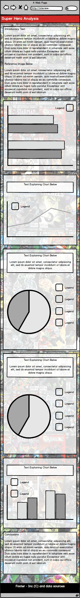

# Super Hero Dashboard

A single page site that presents information and data on over 700 super-heroes (and super-villains!) in a way that allows the user to easily analyse the data to draw their own conclusions.

The page uses the D3.js library with the DC.js and crossfilter.js libraries to present the data via a series of pie charts, bar/row charts, and line charts, all designed to convey the maximum amount of information in the simplest and cleanest way possible.

Finally, the page allows the user to view the individual super-heroes via a dropdown list which allows you to see the remaining heroes after filters have been applied, or to pick out an individual hero and see just their data separate to the rest.

The current deployed version can be found at [https://steview-d.github.io/superhero-dashboard/](https://steview-d.github.io/superhero-dashboard/)

## UX
 
 This dashboard is aimed at users who wish to analyse a large amount of data related to super-heroes and allow them to manipulate it in a way of their choosing and finally, be able to get to the specific data they require.
 
 The journey from seeing the whole data set on screen to either being able to see a specific hero, or analyse the data filtered in a way of the users choosing should be straight-forward and intuitive for the user.
 
 ### User Stories
 
 * As a user, I want to be able to view data on a large number of super-heroes in one place, without the need for swapping between multiple tabs and data sources.
 * As a user, I want to be able to view data on an individual super-hero and see information such as gender, alignment, height, eye color, and so on.
 * As a user, I want to be able to see which attributes are the most common, or rarest, amongst the heroes as a whole.
 * As a user, I want to be able to compare the data at various levels of detail, and to look for connections between the different attributes - for example, does gender have any correlation to hair color?
 * As a user, I want to be able to draw my own conclusions from the data, for example, heroes with blond hair are more likely to have blue eyes.
 * As a user, I want to be able to easily reset the data and start over, and not have to worry about manually setting all the values back to their original values.
 
### Wireframes

The first 2 wireframes (mobile & desktop) were created at the beginning of the project. Whilst they are similar to the final product, they do differ in that the final site displays more data visualization elements than the original wireframes showed.

The final wireframe was put together part way through the project when I could better visualise what I wanted and is a lot closer to the final result.

&nbsp;&nbsp;
 
## Features

### Current Features
###### Feature 1 - Top title bar with Reset Filters button
* The top bar contains the name of the site and also a button that when clicked, resets all the filters back to their default values.
* The bar is fixed to the top of the page so even when the user scrolls down, the user can quickly and easily reset the filters at any point. This avoids the need for constant scrolling up and down the page.

###### Feature 2 - Footer
* A simple footer with a link to the [original dataset](https://www.kaggle.com/thec03u5/complete-superhero-dataset/version/1) on [kaggle](https://www.kaggle.com). Also contains a copyright notice and a link to my [GitHub page](https://github.com/steview-d).

###### Feature 3 - Introduction
* This section contains a very brief introduction to what the site offers the user, alongside some basic instructions. This is kept intentionally brief to allow the UI to guide the user.

###### Feature 4 - Dropdown Filters
* The 'filter by hero' dropdown does just that, it allows the user to see all the heroes in the list, dependent upon applied filters. It also allows the user to select a specific hero to view in isolation.
* The 'filter data by gender' dropdown is also self-explanatory and gives the user the option to apply this filter early in the process.

###### Feature 5 - Pie Charts
* There are 4 pie charts, all displaying different data, they are - alignment, alter-ego, hair color, and eye color. As instructed in the introduction, the user can click on the individual pie slices to filter the data how they choose.
* To avoid clutter and improve readability, the pie charts only shows the most common entries for hair and eye color. The ones that are not shown are grouped into their own section at the end, called others.

###### Feature 6 - Line Charts
* There is 1 line chart, comprised of 6 different sources, each one relating to an attribute of the super-heroes. They are - Intelligence, Strength, Speed, Durability, Power, and Combat. This chart allows the user to see the spread of these attributes across the dataset. The user can hover over the data-point to see the exact values and can also hover over the legend to view just that attribute in isolation.

###### Feature 7 - Row & Bar Charts
* The row chart is used to show the breakdown of heroes by their publisher. As with the other charts, the user can select 1 or more publishers to filter the rest of the data.
* As with the hair and eye color pie charts, the row chart contains an 'other' section to group lots of individual publishers to avoid the list being too long and impacting readability.
* There are 2 similar bar charts, for weight and height. Again, these are fully interactive, and the specific ranges can be selected to apply filters to the rest of the data.

###### Feature - Collapsible Sections
* Each section is collapsible, through the clicking of an icon to the right of each heading. The icon used is a caret symbol so its use should be immediately recognizable to many users.
* This allows the user to directly compare information that might not normally be able to be viewed at the same time due to their different locations on the page. By closing down other sections around it, this allows the user to bring the data they want closer together for easier analysis.

### Future Features
###### Rearrangeable sections
* As it stands, you can close all sections down to just display its header, but I would like to take this one step further and have it so you can manually rearrange the individual sections in any order you choose, anywhere on the page. This would make it even easier to directly compare the data.

###### Separate section to display an individual hero
* Currently, to view an individual hero, the user only needs to select that hero from the drop down, then all elements will change to display just that hero's attributes. I would like to eventually add a section - possibly a pop-up modal element - so that when an individual hero is selected, you can click a button to display this information all together in one place.

## Technologies Used

The following technologies were used in the design and build of this project.

#### [Balsamiq](https://balsamiq.com/) 
- Balsamiq was used for creating the wireframes during the design stage.

#### [HTML5](https://www.w3.org/TR/html/) & [CSS3](https://www.w3.org/Style/CSS/)
- HTML5 & CSS3 were used to create the layout and styling of this site
- Code validators were used to check for errors with the [HTML](https://validator.w3.org/) and [CSS](https://jigsaw.w3.org/css-validator/)

#### [AWS Cloud9](https://aws.amazon.com/cloud9/)
- Cloud9 IDE editor used to write the HTML, CSS and JavaScript.

#### [Bootswatch](https://bootswatch.com/3/)
- Bootswatch 3.4.1 ([Spacelab](https://bootswatch.com/3/spacelab/) theme for [bootstrap 3](https://getbootstrap.com/docs/3.3/)) was used to assist in the creation of the responsive grid structure for the site and also to provide some basic CSS styling.

#### [JavaScript](https://developer.mozilla.org/en-US/docs/Web/JavaScript)
* JavaScript and selected external libraries have been used throughout this site, in the following ways:
* For the creation and manipulation of the data-visualization elements, JavaScript and the following libraries were used
    * [D3.js](https://d3js.org/)
    * [DC.js](https://dc-js.github.io/dc.js/)
    * [Crossfilter.js](http://square.github.io/crossfilter/)
* [D3-queue.js](https://github.com/d3/d3-queue) was used to load the dataset fully before running any other files.
* [jQuery](https://jquery.com/) was used to assist with DOM manipulation when resetting filters and showing / hiding selected sections.
* [JSHint](https://jshint.com/) was used to check for errors and code quality.

#### [Adobe Photoshop CC](https://www.photoshop.com/)
- Photoshop was used to create and edit the background image.

#### [Tiny JPG](https://tinyjpg.com/)
- Tiny JPG was used to reduce the size of all .jpg's (and .png's) to assist with page loading times. This was mainly to reduce the file size of the background image.

#### [Font Awesome](https://origin.fontawesome.com/)
- Font Awesome was used to provide the icons for the GitHub logo in the site footer, the gender icons used in the gender section, and the caret icon used to show/hide individual sections.

#### [Git & GitHub](https://github.com/)
- Git used for version control. GitHub used as a remote repository and the hosting of this site.

## Testing ####

The site has been thoroughly tested in many ways. The JavaScript and its associated functions have all undergone extensive manual testing. A write up of this, along with the results, can be found [here](/manual_testing/test.md).

The responsiveness and correct displaying of all elements has been tested on a number of devices, browsers, and resolutions. Chrome, Firefox, Opera, Edge, and IE all display without issue. There was one issue with IE which was fixed and is discussed in the JS testing section.

Chrome dev tools were used to simulate multiple devices and widths, and no issues were encountered.

The following physical devices tested with no issues found.
- Windows desktop at HD, QHD, and UWQHD resolutions
- Google Pixel 2XL
- Apple iPhone 8S
- Apple iPad mini

The site has been tested against all user stories listed in the UX section above. I was able to do everything the user would want to be able to do. I was able to compare the data easily by minimizing certain sections, I could filter the specific data I needed to, I could reset all the filters if I needed to. I was able to analyse the data and draw my own conclusions as well as verify observations on the data made by others.

#### Known Issues
There has been only 1 issue I could not fix, and instead have had to implement a workaround. The line chart has a horizontal legend which uses .horizontal(true) with dc.legend to change it from the default vertical legend.
When .autoItemWidth is chained to it and set to true, it causes a display bug whereby the legend entries are bunched up together and overlapping, rendering it unreadable. This isn't immediately noticeable as it only happens if the line chart is hidden using the jQuery toggle, a filter is set, and then it is toggled back to be shown.
It is easily fixed by reloading the page, but to avoid the user having to do this I have set .autoItemWidth to false and instead used .itemWidth with a value. Unfortunately, this doesn't display as well due to each word being a different number of characters, therefore the spacing appears uneven, but it does prevent this bug from occurring.

## Deployment ####

The site was developed using the cloud9 IDE and uses git for version control which is then pushed to GitHub. The site is hosted on GitHub Pages and deployed there from the master branch on GitHub. There is no difference between the development version of this site, and the final version hosted on GitHub Pages.

To deploy this project, I took the following initial steps:
- From my GitHub page I clicked on 'Repositories' and selected the required repository, in this case 'superhero-dashboard'
- I then clicked on the 'settings' option, located on the top horizontal menu bar
- Next, I scrolled down the page to the GitHub Pages section and located the dropdown box under 'Source'
- From there I selected the 'master branch'
- GitHub takes you back to the top of the page to allow you to rename the repository if desired. I kept it the same.
- These steps resulted in the finished site being deployed at [https://steview-d.github.io/superhero-dashboard/](https://steview-d.github.io/superhero-dashboard/)

Every subsequent push to GitHub on the master branch updates the deployed site to match.

## Credits

### Content
- All text was written by myself. The site was designed and built in full by myself.
- The source dataset was obtained from [kaggle](https://www.kaggle.com) user [Aman Shrivastava](https://www.kaggle.com/thec03u5) and can be found [here](https://www.kaggle.com/thec03u5/complete-superhero-dataset).
- Note - The original .csv file contained additional columns of data which have been removed from the dataset used for this project. This was for a number of reasons, usually due to that particular attribute not being used thus allowing a reduction in file size, or where some attributes were missing so much data it rendered it pointless. However, no heroes have been removed, all 700+ are still present and furthermore, where some heroes have attributes with missing data, these have been kept intentionally blank. Rather than filling them with placeholder data I decided to preserve the accuracy of the original dataset. For more information on how this affects the data as a whole, refer to the JS testing document [here](/manual_testing/test.md).
- The kaggle dataset was originally scraped from the [SHDB](https://www.superherodb.com/) in June 2017.

### Media
- The original unmodified background image was sourced from google image search. It has since been modified and is being used in a non-profit educational capacity.

### Acknowledgements ####
- [Antonija Šimić](https://github.com/tonkec "Antonija's GitHub page"), my Code Institute mentor, for her invaluable advice and guidance.
- The slack channel community over at [Code Institute](https://codeinstitute.net/), and specifically thanks to 'johnL3', 'Eventyret', and '2BN-Tim' for their helpful feedback.
- The [dc.js documentation](https://dc-js.github.io/dc.js/docs/html/index.html), or more specifically, the folks who wrote it, for making such a well-structured and easy to follow set of docs.
- [Imagine Dragons](https://www.imaginedragonsmusic.com/), for somehow managing to make the perfect music to problem solve with.

